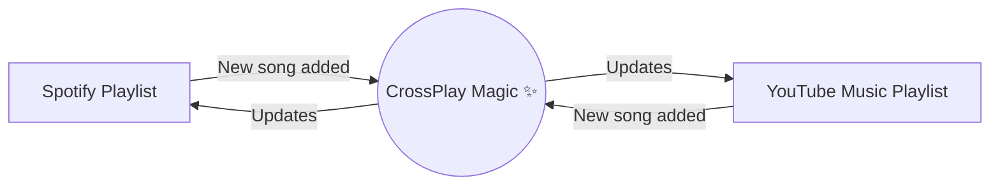

# 🎵 CrossPlay

Welcome to CrossPlay! This app lets you sync playlists across spotify and youtube music seamlessly. I made this app becuase I wanted to have a shared playlist with someone on a different platform. This does the job pretty well. You can also use this app to migrate playlists from one platform to another.

When you add a new song to your playlist on Spotify, it automatically appears on YouTube Music within a few minutes—and vice versa! You only need to set it up once, and then it quietly does its magic in the background.


## 🌟 How it works

Imagine you have a playlist on Spotify and another one on YouTube Music. CrossPlay acts as an invisible bridge between them.



- **Two-way Sync:** Add a song on one platform, and it pops up on the other.
- **Add-only:** If you delete a song, it won't delete it on the other side. This keeps your music safe from accidental deletions!
- **Smart Matching:** It searches for the exact song. If it can't find it easily, it tries really hard using the artist name, song title, and track length to find the best match.
- **No Duplicates:** It remembers what it has already synced, so it will never add the same song twice.

## 🛠️ What do you need?

To get started, you'll need:
- A computer with Python installed (version 3.11 or newer).
- A Spotify Premium account (needed to create a connection).
- A Google account (for YouTube Music).

## 🚀 Step-by-Step Setup

Follow these steps to get everything running!

### 1. Download the Project
First, grab a copy of this app and install the necessary pieces:
```bash
git clone https://github.com/Yatha04/CrossPlay.git
cd CrossPlay
pip install -r requirements.txt
```

### 2. Set Up Your Secret Keys
Set up your credentials in `.env`.

Copy the example settings file to create your own:
```bash
cp .env.example .env
```

Open the new `.env` file and fill in your details:
- **Spotify Details:** Create an app on the [Spotify Developer Dashboard](https://developer.spotify.com/) to get your `Client ID` and `Client Secret`.
- **Playlist IDs:** The unique links of the playlists you want to sync.

### 3. Authenticate
Use the interactive CLI to connect both your Spotify and YouTube Music accounts. Just run:
```bash
python cli.py auth
```
Follow the simple prompts in your terminal to complete the setup!

### 4. Use CrossPlay!
The CLI gives you a few powerful commands to run:

**Start the Background Sync Daemon**
To keep things constantly synced in the background (by default, every 3 minutes):
```bash
python cli.py daemon
```

**Perform a One-Off Sync**
```bash
python cli.py sync
```

**Migrate a Public Playlist**
Easily migrate any public playlist to Spotify or YouTube Music with a beautiful live progress bar:
```bash
# Migrate to Spotify
python cli.py migrate "https://music.youtube.com/playlist?list=..." --to spotify

# Migrate to YouTube Music
python cli.py migrate "https://open.spotify.com/playlist/..." --to youtube_music
```

---

### How I built this:
- I used FastAPI and SQLite to build the backend, so its fast and lightweight. 
- It uses a 5-step search system to find the best match for a song, and it uses a 3-step system to verify the match. 
- You can run 'pytest tests/ -v' to check all 206 automated tests!